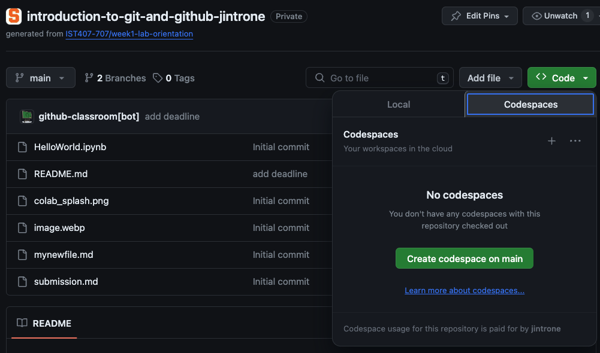
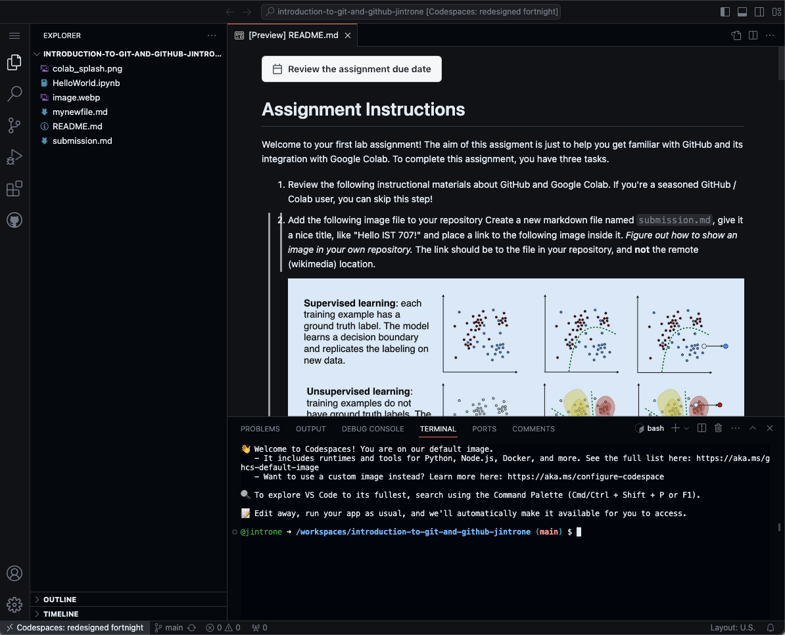
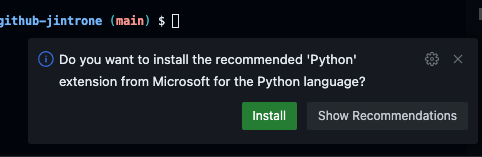
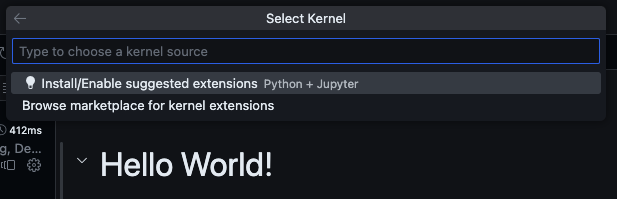
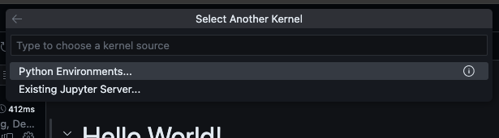
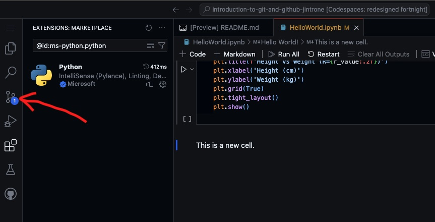
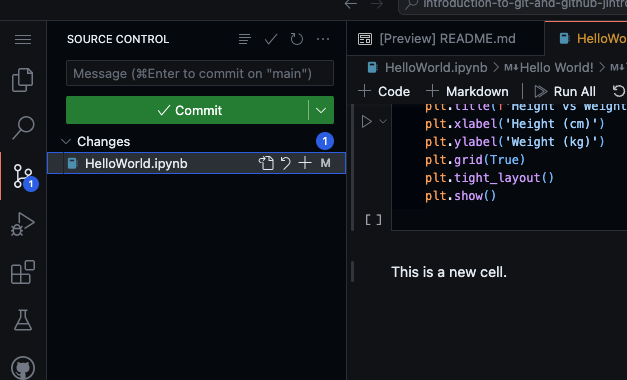
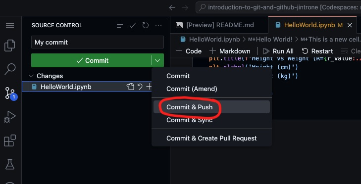

# Assignment Instructions

Welcome to  part 1 of your first assignment (we'll do this in class)! The aim of this assigment is just to help you get familiar with GitHub, codespaces, and GitHub's integration with Google Colab.  To complete this assignment, you have four tasks.

1. Review the following instructional materials about GitHub, GitHub codespaces, and Google Colab. 
2. Add the following image file to your repository Create a new markdown file named `submission.md`, give it a nice title, like "Hello IST 707!" and place a link to the following image inside it.  *Figure out how to show an image in your own repository.* The link should be to the file in your repository, and **not** the remote (wikimedia) location.  That means you need to download the image to your own repository, and then link to it.  See the GitHub flavored [markdown documentation](https://docs.github.com/en/get-started/writing-on-github/getting-started-with-writing-and-formatting-on-github/basic-writing-and-formatting-syntax). Note in particular the section on linking to [images in your repository](https://docs.github.com/en/get-started/writing-on-github/getting-started-with-writing-and-formatting-on-github/basic-writing-and-formatting-syntax#images).

   

3. Open "HelloFromCodespaces.ipynb" in codespaces and run the first code cell.  Remember to commit your changes with a comment.
4. Open "HelloFromColab.ipynb" in google colab an run the first cell.  Save your result back into your repo.

That's it!  

Using GitHub with Codespaces
============================

GitHub provides virtual machines to students for free as part of its educational platform while working on GitHub classroom exercises. This a huge benefit and extremely convenient.  You can learn more about codespaces with this [primer](https://education.github.com/experiences/primer_codespaces).  There is also a complete set of documentation [here](https://docs.github.com/en/codespaces/overview).

Creating a codespace on your repository
---------------------------------------

To create a codespace for an assignment you have accepted, click on the "Code" button in your repository and select the "Codespaces" tab.

Click the "Create codespace on main" button.  This will give you a brand new Virtual Machine (by default, with 8G Ram and 2 cores, which should be sufficient in most cases).  Your repository will automatically be cloned into the codespace.

To work on a jupyter notebook within your codespace, you'll need to select a kernel.  By default, your codespace should come with all you need to launch the kernel, but there are a few clicks to make this happen.

1. Open your jupyter notebook by clicking in the file browser on the left.  In most cases, the codespace will automatically pop up a notification in the lower right corner of the screen, prompting you to install the Python extension.  Click "Install".  

If not, you can just move on to the next step.

2. After the extension installs, you will likely get an information page about the extension.  Close this to navigate back to the Jupyter notebook, and then click "Select Kernel."

3. This will open a drop-down menu at the top of the screen.  Click "Install/Enable Suggested Extensions"

4. You will see another drop-down menu.  

5. Click "Python environments" and then select the version of Python that appears.

That's it!  You should see the version of Python you selected in the upper right of the screen.  You can now run and edit cells in your Jupyter notebook!

Committing your changes
-----------------------
After you've made some changes, you'll want to push your changes back to your GitHub repo.  Note that until you do this, your changes will only exist on the codespace, and will not be pushed back to your repository.  After a period of inactivity (usually a few days), codespaces are deleted and cannot easily be recovered, so it's a good idea to commit after you're done working for the day.

Your codespace will tell you if you have pending changes to commit with an indicator on the source control icon.  Note the "1" in the screenshot below.

To commit your changes:

1. Click the source control button (the one with the indicator).  You will get a commit panel on the left hand side.

2. **Make sure to enter a commit message!**  Every commit requires a commit message.  This can be something simple, but cannot be empty.  If you do not provide a commit message, your codespace will open a new tab for the commit message which is very easy to miss.

3. After entering your message, click the drop down arrow on the right of the commit button and select "Commit & Push."  The "Push" part is necessary to get your codespace to sync it's changes back to GitHub.

> **Note:** you will get a message about staging changes; simply click "Yes" to make sure you stage all of your changes.

That's it! Once you have done the above steps, your assignment will count as being submitted.  You can do this as many times as you want up until the due date.

Managing codespaces
-------------------

Generally speaking, you won't need to do anything to manage your codespaces.  However, here are a couple of tips that will streamline things moving forward.

1. After creating a codespace, that codespace will be available in the "Code" tab on your repository.  You should continue to reuse this codespace for all work on the repository.

2. You have a limited (albeit generous) allotment of hours for codespace use per week.  If you are going to be away from your computer, please remember to close the browser tab, or else you will continue to use your quota.

3. Codespaces are deleted after a period of disuse; you will normally get an email about this.  If you've committed your code, you can ignore these messages!  If not, commit your code and / or follow the guidance in the notification email for preserving the codespace.

4. You can manage your active codespaces by browsing to https://github.com/codespaces.  From there, it is possible to terminate or delete any running codespace, browse directly to the codespace, or change the machine type.

Using GitHub with Google Colab
==================================

Google Colab has convenient Git integration. This will enable you to edit notebooks in Colab and then commit and push changes back to the repository without ever leaving Colab in your browser.  This is especially useful when you need access to a GPU, which codespaces does not provide.

Setting up GitHub access from Colab
-----------------------------------

In order to access Git repositories, in particular private ones like you are using in this class, you need to allow Colab to access the repositories. To set this up, make sure you are logged in to your google account (I recommend using your SU g-suite account, that is `<netid>@g.syr.edu`. Then, follow the steps below.

1.  Go to the main Google Colab page <https://colab.research.google.com/>. You will get a splash page that looks like this.

   Click on the "GitHub" tab of the orange bar.

2.  Click the checkbox for including private repos.
3.  An authorization window from GitHub will pop up. (Make sure you are not blocking pop-up windows.) You should authorize Colab to access the IST407-707 organization and your repositories.
4.  Under where it says "Enter a GitHub URL or search by organization or user," search for your assignment's repository name, such as ``ist407-707/warm-up-assignment1-<github username>``, replacing `<github-username>` with your actual username. Underneath the search bar, you will have a pulldown menu of available notebooks. Select the one you want to work on.

Pushing your notebook to the repository
----------------------------------------

After you have made changes to your notebook, you can commit and push them to the repository. To do so from within a Colab notebook, click ``File`` → ``Save a copy in GitHub``. You will be prompted to add a commit message, and after you click ``OK``, the notebook will be pushed to your repository.

Chrome plug-in for quick access
-------------------------------

If you use Chrome as your browser, there is a convenient plug-in called [Open in Colab](https://chrome.google.com/webstore/detail/open-in-colab/iogfkhleblhcpcekbiedikdehleodpjo) that allows you to open a notebook from any GitHub page in Colab. So, after installing the plugin, if you are on the webpage of your repository, you can click the icon next to the address bar in your Chrome browser and the notebook will open in Colab. You can then proceed to push the notebook back to the repository (using the `Save a copy in GitHub` method above after making your changes as described above.

Accessing other repository files
--------------------------------

One drawback of the above method is that this will clone a single notebook, but not the data or other files in the directory.  To access these files, you will need to store them in your google drive and then mount your google drive in Colab.  This is not ideal, and one of the reasons why codespaces are a more convenient option!

# :wave: The Basics of GitHub 

## 🤓 Course overview and learning outcomes 

The goal of this assignment is to give you a brief introduction to GitHub. We’ll also provide you with materials for further learning and a few ideas to get you started on our platform. 🚀

## :octocat: Git and GitHub

Git is a **distributed Version Control System (VCS)**, which means it is a useful tool for easily tracking changes to your code, collaborating, and sharing. With Git you can track the changes you make to your project so you always have a record of what you’ve worked on and can easily revert back to an older version if need be. It also makes working with others easier—groups of people can work together on the same project and merge their changes into one final source!

GitHub is a way to use the same power of Git all online with an easy-to-use interface. It’s used across the software world and beyond to collaborate and maintain the history of projects.

GitHub is home to some of the most advanced technologies in the world. Whether you're visualizing data or building a new game, there's a whole community and set of tools on GitHub that can get you to the next step. This course starts with the basics of GitHub, but we'll dig into the rest later.

## :octocat: Understanding the GitHub flow 

The GitHub flow is a lightweight workflow that allows you to experiment and collaborate on your projects easily, without the risk of losing your previous work.

### Repositories

A repository is where your project work happens--think of it as your project folder. It contains all of your project’s files and revision history.  You can work within a repository alone or invite others to collaborate with you on those files.

### Cloning 

When a repository is created with GitHub, it’s stored remotely in the ☁️. You can clone a repository to create a local copy on your computer and then use Git to sync the two. This makes it easier to fix issues, add or remove files, and push larger commits. You can also use the editing tool of your choice as opposed to the GitHub UI. Cloning a repository also pulls down all the repository data that GitHub has at that point in time, including all versions of every file and folder for the project! This can be helpful if you experiment with your project and then realize you liked a previous version more. 
To learn more about cloning, read ["Cloning a Repository"](https://docs.github.com/en/github/creating-cloning-and-archiving-repositories/cloning-a-repository). 

### Committing and pushing
**Committing** and **pushing** are how you can add the changes you made on your local machine to the remote repository in GitHub. That way your instructor and/or teammates can see your latest work when you’re ready to share it. You can make a commit when you have made changes to your project that you want to “checkpoint.” You can also add a helpful **commit message** to remind yourself or your teammates what work you did (e.g. “Added a README with information about our project”).

Once you have a commit or multiple commits that you’re ready to add to your repository, you can use the push command to add those changes to your remote repository. Committing and pushing may feel new at first, but we promise you’ll get used to it 🙂

## 💻 GitHub terms to know 

### Repositories 
We mentioned repositories already, they are where your project work happens, but let’s talk a bit more about the details of them! As you work more on GitHub you will have many repositories which may feel confusing at first. Fortunately, your ["GitHub dashboard"](https://docs.github.com/en/github/setting-up-and-managing-your-github-user-account/about-your-personal-dashboard) helps to easily navigate to your repositories and see useful information about them. Make sure you’re logged in to see it!

Repositories also contain **README**s. You can add a README file to your repository to tell other people why your project is useful, what they can do with your project, and how they can use it. We are using this README to communicate how to learn Git and GitHub with you. 😄 
To learn more about repositories read ["Creating, Cloning, and Archiving Repositories](https://docs.github.com/en/github/creating-cloning-and-archiving-repositories/about-repositories) and ["About README's"](https://docs.github.com/en/github/creating-cloning-and-archiving-repositories/about-readmes). 

### Branches
You can use branches on GitHub to isolate work that you do not want merged into your final project just yet. Branches allow you to develop features, fix bugs, or safely experiment with new ideas in a contained area of your repository. Typically, you might create a new branch from the default branch of your repository—main. This makes a new working copy of your repository for you to experiment with. Once your new changes have been reviewed by a teammate, or you are satisfied with them, you can merge your changes into the default branch of your repository.
To learn more about branching, read ["About Branches"](https://docs.github.com/en/github/collaborating-with-issues-and-pull-requests/about-branches).

### Forks
A fork is another way to copy a repository, but is usually used when you want to contribute to someone else’s project. Forking a repository allows you to freely experiment with changes without affecting the original project and is very popular when contributing to open source software projects!
To learn more about forking, read ["Fork a repo"](https://docs.github.com/en/github/getting-started-with-github/fork-a-repo)

### Pull requests
When working with branches, you can use a pull request to tell others about the changes you want to make and ask for their feedback. Once a pull request is opened, you can discuss and review the potential changes with collaborators and add more changes if need be. You can add specific people as reviewers of your pull request which shows you want their feedback on your changes! Once a pull request is ready-to-go, it can be merged into your main branch.
To learn more about pull requests, read ["About Pull Requests"](https://docs.github.com/en/github/collaborating-with-issues-and-pull-requests/about-pull-requests). 

### Issues
Issues are a way to track enhancements, tasks, or bugs for your work on GitHub. Issues are a great way to keep track of all the tasks you want to work on for your project and let others know what you plan to work on. You can also use issues to tell a favorite open source project about a bug you found or a feature you think would be great to add!

For larger projects, you can keep track of many issues on a project board. GitHub Projects help you organize and prioritize your work and you can read more about them [in this "About Project boards document](https://docs.github.com/en/github/managing-your-work-on-github/about-project-boards). You likely won’t need a project board for your assignments, but once you move on to even bigger projects, they’re a great way to organize your team’s work!
You can also link together pull requests and issues to show that a fix is in progress and to automatically close the issue when someone merges the pull request.
To learn more about issues and linking them to your pull requests, read ["About Issues"](https://docs.github.com/en/github/managing-your-work-on-github/about-issues). 

### Your user profile

Your profile page tells people the story of your work through the repositories you're interested in, the contributions you've made, and the conversations you've had. You can also give the world a unique view into who you are with your profile README. You can use your profile to let future employers know all about you! 
To learn more about your user profile and adding and updating your profile README, read ["Managing Your Profile README"](https://docs.github.com/en/github/setting-up-and-managing-your-github-profile/managing-your-profile-readme). 

### Using markdown on GitHub 

You might have noticed already, but you can add some fun styling to your issues, pull requests, and files. ["Markdown"](https://guides.github.com/features/mastering-markdown/) is an easy way to style your issues, pull requests, and files with some simple syntax. This can be helpful to organize your information and make it easier for others to read. You can also drop in gifs and images to help convey your point!
To learn more about using GitHub’s flavor of markdown, read ["Basic Writing and Formatting Syntax"](https://docs.github.com/en/github/writing-on-github/basic-writing-and-formatting-syntax). 

### Engaging with the GitHub community

The GitHub community is vast. There are many types of people who use GitHub in their day to day—students like you, professional developers, hobbyists working on open source projects, and explorers who are just jumping into the world of software development on their own. There are many ways you can interact with the larger GitHub community, but here are three places where you can start. 

#### Starring repositories 

If you find a repository interesting or you want to keep track of it, star it! When you star a repository it’s also used as a signal to surface better recommendations on github.com/explore. If you’d like to get back to your starred repositories you can do so via your user profile. 
To learn  more about starring repositories, read ["Saving Repositories with Stars"](https://docs.github.com/en/github/getting-started-with-github/saving-repositories-with-stars). 

#### Following users 

You can follow people on GitHub to receive notifications about their activity and discover projects in their communities. When you follow a user, their public GitHub activity will show up on your dashboard so you can see all the cool things they are working on. 
To learn more about following users, read ["Following People"](https://docs.github.com/en/github/getting-started-with-github/following-people).

#### Browsing GitHub Explore 

GitHub Explore is a great place to do just that … explore :smile: You can find new projects, events, and developers to interact with.

You can check out the GitHub Explore website [at github.com/explore](https://github.com/explore). The more you interact with GitHub the more tailored your Explore view will be. 

## 📚  Resources 
* [A short video explaining what GitHub is](https://www.youtube.com/watch?v=w3jLJU7DT5E&feature=youtu.be) 
* [Git and GitHub learning resources](https://docs.github.com/en/github/getting-started-with-github/git-and-github-learning-resources) 
* [Understanding the GitHub flow](https://guides.github.com/introduction/flow/)
* [How to use GitHub branches](https://www.youtube.com/watch?v=H5GJfcp3p4Q&feature=youtu.be)
* [Interactive Git training materials](https://githubtraining.github.io/training-manual/#/01_getting_ready_for_class)
* [GitHub's Learning Lab](https://lab.github.com/)
* [Education community forum](https://education.github.community/)
* [GitHub community forum](https://github.community/)
